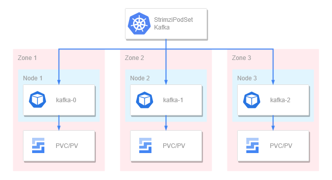
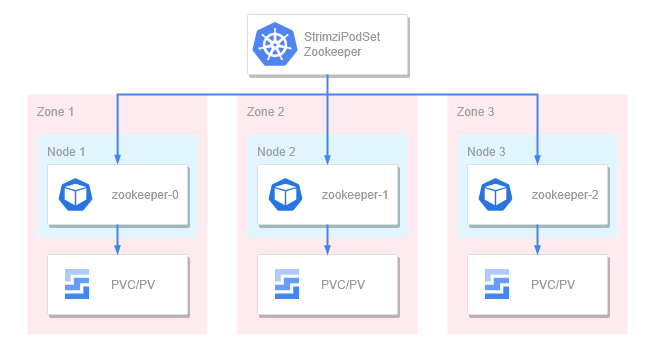
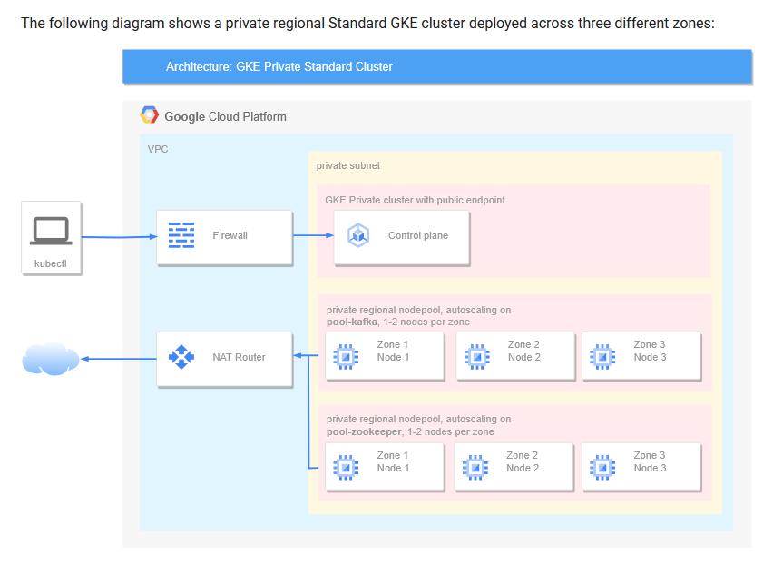
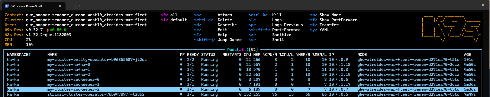
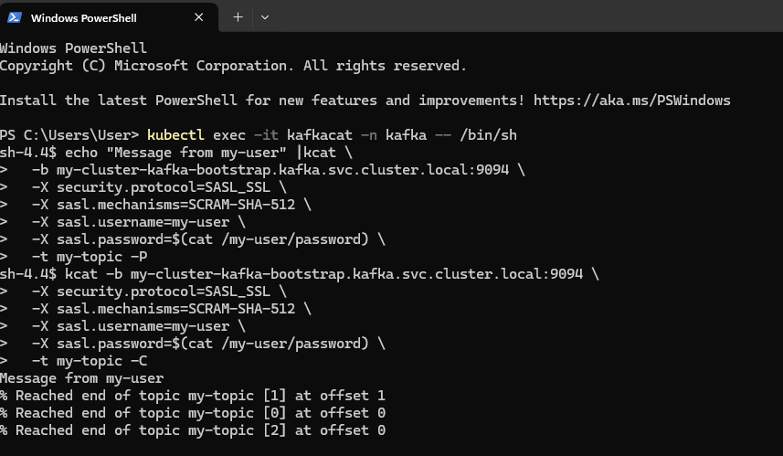

# Configuring a Kafka GKE cluster for Data-Streaming using the Strimzi Operator



---

## What is Kafka and What is Data Streaming?

Kafka is an open-source, distributed messaging system designed to handle high-volume, high-throughput, and real-time streaming data. It lets you build streaming data pipelines for reliable data transfer across different systems and applications, to support processing and analysis tasks.

Similar in many facets when compared to managed and traditional pub-sub tools, Kafka can be used as frontend to begin a data-processing pipeline, organize batches of data for an application or it can be used to prepare data to serve and train an ML models. 

The core value of using Kafka is to **organize, stream, and track the state of high-throughput data**, whether originating from internal systems or external clients.  
A key feature is Kafka’s ability to **persist data**, allowing it to be **re-read or reprocessed later** using timestamps or offsets — making it a rather versatile tool and ideal for fault-tolerant pipelines and replayable data flows.

---

### 🔑 Essential Key Components of Kafka:
#####  Producer:
> An application or system that **sends data into Kafka**.  
> Producers can be internal microservices, external client apps, or connectors that transform and forward data into Kafka topics.

##### Broker:
> A Kafka **server node** that receives, stores, and serves data.  
> Brokers handle data ingestion from producers, manage topic partitions, and serve consumer requests. Multiple brokers form a Kafka cluster, distributing data and load.

##### ZooKeeper _(deprecated in newer Kafka versions):
> A **coordination service** used to manage broker metadata, leader elections, and cluster state.  
> While still used in most deployments, ZooKeeper is being phased out in favor of **KRaft mode** (Kafka's native consensus system).

##### Topic:
> The **logical container** that holds and organizes message streams.  
> Each topic can be **divided into partitions**, allowing for parallelism and scalability. Data is **appended to partitions**, where it's retained for a configurable amount of time (regardless of consumption). Can be created server side or client side using the Kafka programming library.
##### Partition:
> Each topic is split into one or more **partitions**, which are **ordered, immutable sequences** of messages.  
> Partitioning enables **parallel processing**, **scalability**, and **distributed consumption** by allowing multiple consumers to read from different partitions simultaneously.
##### Consumer:
> An application or service that **reads messages** from Kafka topics.  
> Consumers can work individually or as part of a **consumer group**, where each group member is assigned specific partitions to consume. This model ensures **load balancing** and **fault tolerance** across consumers.
##### Offset:
> A numeric **pointer to the position of a message** within a partition.  
> Offsets allow consumers to keep track of what data they’ve already processed. Consumers can resume reading from the last known offset or **rewind to earlier offsets** to reprocess data.
##### Retention:
> Kafka retains messages in partitions for a **fixed time period or size limit**, regardless of whether they’ve been consumed.  
> This design enables **replayability**, **auditing**, and the ability to recover from downstream failures without needing producers to resend the data.

*Whew A lot of unique and specific Vocabulary*

---

## My Deployment Strategy

When preparing a Kafka deployment, designing for fault tolerance isn’t optional — it’s the entire point. Without resilient architecture, you lose the operational strengths Kafka was built for: high availability, fault tolerance, and event replayability.

My deployment follows the guidance outlined in Google’s official [Strimzi on GKE tutorial](https://cloud.google.com/kubernetes-engine/docs/tutorials/apache-kafka-strimzi), adapted for production-readiness and tested for stability across availability zones.

I provisioned a regional GKE cluster spanning three zones, each with its own dedicated node pool. Each pool has autoscaling enabled independently to handle demand within that specific zone. More importantly, I labeled each node to match the affinity rules defined in the Strimzi CRDs. This labeling is essential because the pod affinity configuration ensures one Kafka broker and one Zookeeper node per zone — achieving true 1:1 distribution. This strategy supports the most effective failover behavior, ensuring resilience during rolling updates or zonal outages.


*Affinity Label for Kafka*
```yaml
  kafka:
    version: 3.8.1
    replicas: 3
    template:
      pod:
        tolerations:
        - key: "app.stateful/component"
          operator: "Equal"
          value: "kafka-broker"
          effect: NoSchedule
        affinity:
          nodeAffinity:
            preferredDuringSchedulingIgnoredDuringExecution:
            - weight: 1
              preference:
                matchExpressions:
                - key: "app.stateful/component"
                  operator: In
                  values:
                  - "kafka-broker"
        topologySpreadConstraints:
        - maxSkew: 1
          topologyKey: "topology.kubernetes.io/zone"
          whenUnsatisfiable: DoNotSchedule
          labelSelector:
            matchLabels:
              app.kubernetes.io/name: kafka
              strimzi.io/cluster: my-cluster
              strimzi.io/component-type: kafka
```


*Affinity label for Zookeeper*
```yaml
  zookeeper:
    template:
      pod:
        affinity:
          nodeAffinity:
            preferredDuringSchedulingIgnoredDuringExecution:
            - weight: 1
              preference:
                matchExpressions:
                - key: "app.stateful/component"
                  operator: In
                  values:
                  - "zookeeper"
        topologySpreadConstraints:
        - maxSkew: 1
          topologyKey: "topology.kubernetes.io/zone"
          whenUnsatisfiable: DoNotSchedule
          labelSelector:
            matchLabels:
              app.kubernetes.io/name: zookeeper
              strimzi.io/cluster: my-cluster
              strimzi.io/component-type: zookeeper
```

*Node pool labels (Terraform)*
```yaml
    labels = {
      role      = "fremen"
      kafka     = "true" # These tie to Pod affinity ensuring even distribtion.
      zookeeper = "true"
    }
```


Kafka, by nature, is resource intensive. I selected the `n2-standard-8` machine type for each node, giving me 8 vCPUs and 32 GB of memory per instance. This provides a stable foundation to run Strimzi's operator, brokers, Zookeeper, and entity operators without contention. I recommend provisioning at least two of these nodes during initial deployment to give the cluster enough capacity to launch all core components successfully.

Another critical detail is the configuration of readiness and liveness probes. These are easy to misconfigure in Kafka, and doing so can trigger premature restarts, memory leaks, or even partition loss if probes aren’t aligned with Kafka’s startup behavior. It's vital to design them conservatively and test upgrades to ensure they support your workload, rather than disrupt it.

The manifests and Terraform infrastructure for this deployment live in my repo, and they reflect all of these considerations in practice.



---
## Cluster and Operator Deployment

1. Make sure to increase your Resource quota for your desired region to at least 24 CPUs before using my configuration.

2.  Git clone my Repository; deploy the cluster from top level and await completion.
```shell
git clone 
# >>>
terraform apply --var-file=003-change_me.tfvars --auto-approve
```

3. After completion and signing into your cluster Use helm to install the Strimzi operator; and check the pod status for completion.
```shell
helm repo add strimzi https://strimzi.io/charts/
# >>>
helm repo update
# >>>
kubectl create ns kafka
# >>>
helm install strimzi-operator strimzi/strimzi-kafka-operator -n kafka
# >>>
kubectl get pods -n kafka
```
*This will take a few moments to correctly install, be patient*


4. Now we can deploy our main working broker and zookeeper pods
```shell
kubectl apply -f cluster-app
```
*This will take even longer so be even more patient*


You should have 8 pods upon full configuration:


---

## User-Identity, Topic, and Producer Deployment

In this configuration The topic will be created server side prior to the message request being initiated. We will create a client pod/application within the cluster to generate and send messages to our topic. 

In our Demo example our testing application plays both roles of the *Producer* and the *Consumer* by making the request to both produce data and consume it.

We give our producer client permissions to write to our topic using the below CRD with Custom Resource which will create a username and password with RBAC permissions. The *strong-password* is then automatically stored as a Kubernetes  secret which we can mount as a `volume` and `env` on our producer application. 


*User Custom Resource*
```yaml
apiVersion: v1
kind: ConfigMap
metadata:
  name: kcat-config
data:
  kcat.conf: enable.ssl.certificate.verification=false
---
apiVersion: kafka.strimzi.io/v1beta2
kind: KafkaUser
metadata:
  name: my-user
  labels:
    strimzi.io/cluster: my-cluster
spec:
  authentication:
    type: scram-sha-512
  authorization:
    type: simple
    acls:
      - resource:
          type: topic
          name: my-topic
          patternType: literal
        operations:
          - Create
          - Describe
          - Write
          - Read
        host: "*"
```
- *Do note that communication between our broker and producer can be encrypted using ssl. But this is disabled through the initiated configmap for lab demonstration purposes.*


*The Producer application (This consumes the user credentials from kubectl secrets and will serve as the platform to execute our sample message batch)*
```yaml
apiVersion: v1
kind: Pod
metadata:
  name: kafkacat
spec:
  containers:
  - name: kafkacat
    image: confluentinc/cp-kcat:7.5.1
    command: ["sh", "-c", "exec tail -f /dev/null"]
    volumeMounts:
    - name: my-user
      mountPath: "/my-user"
      readOnly: true
    - name: config-volume
      mountPath: /home/appuser/.config
  volumes:
  - name: my-user
    secret:
      secretName: my-user
  - name: config-volume
    configMap:
      name: kcat-config
```


### Now that we understand what we're working with, let's begin the deployment


1. Change directories into the `Users` folder and Create your Topic and user Identity
```shell
kubectl apply -n kafka -f topic.yaml
# >>>
kubectl apply -n kafka -f my-user.yaml
```


2. Now create the Producer application and wait a few moments for a successful deployment
```shell
kubectl apply -n kafka -f kafkacat.yaml
```


3. After confirmation of completion, Exec inside of the pod so we can initiate our message request.
```shell
kubectl exec -it kafkacat -n kafka -- /bin/sh
```


4. Now After inside Copy and paste the entirety of the below command to create our first request to test our brokers.  

*The command does as follows*
- The `echo` statement carries the string data we are sending to our topic
- We identify the cluster DNS name of the broker svc to reach the brokers
- We specify SSL as the communication protocol
- We specify the Password type and insert the `env` variables into our statement to authenticate
- We then select the topic we created to store our data. *The -P Flag sets producer mode so that our message is delivered to the topic*
- The 2nd half of the statement ends with a -C instructing a potential consumer to consume the data stored in our topic

*To keep it simple the first half is the command to produce data whilst the 2nd half is the command for the consumption of the topics stored data.*

Input:
```shell
echo "Message from my-user" |kcat \
  -b my-cluster-kafka-bootstrap.kafka.svc.cluster.local:9094 \
  -X security.protocol=SASL_SSL \
  -X sasl.mechanisms=SCRAM-SHA-512 \
  -X sasl.username=my-user \
  -X sasl.password=$(cat /my-user/password) \
  -t my-topic -P
kcat -b my-cluster-kafka-bootstrap.kafka.svc.cluster.local:9094 \
  -X security.protocol=SASL_SSL \
  -X sasl.mechanisms=SCRAM-SHA-512 \
  -X sasl.username=my-user \
  -X sasl.password=$(cat /my-user/password) \
  -t my-topic -C
```

Output upon successful execution and consumption:
```shell
Message from my-user
% Reached end of topic my-topic [1] at offset 1
% Reached end of topic my-topic [0] at offset 0
% Reached end of topic my-topic [2] at offset 0
```




---

And That's a wrap for this demo! Feel free to DM me if you have any questions or issues trying to replicate this deployment. 

Feel free to expand upon this configuration as this can be used to prepare data for a wide variety of use cases. 
